<!-- 顶部波浪 Banner -->

<!-- 中文打字机动画 -->

<!-- 访客计数 & 关注 -->

  
  

---

## 🧑‍💻 关于我

- 🔭 目前专注于 **Java 后端** 开发，顺手玩转 **全栈**
- 🌱 正在深耕 **TypeScript** 生态，前端 **Vue / React** 双持
- 💬 聊得来的话题：**Spring / 微服务 / 前端工程化 / 造轮子**
- ⚡ 座右铭：能用代码解决的问题，绝不手动重复第二遍
- 📫 找我：给下面的社交徽章加个链接就好啦

## 🛠️ 技术栈

## 📊 GitHub 数据

<!-- 自托管生成，不走公共实例，永不限流 -->

## 🗓️ 年度提交热力图

<!-- 3D 提交热力图，同样自托管生成 -->

## 🐍 贡献图上的贪吃蛇

<picture>
  <source media="(prefers-color-scheme: dark)" srcset="https://raw.githubusercontent.com/lecyun/lecyun/output/github-contribution-grid-snake-dark.svg" />
  <source media="(prefers-color-scheme: light)" srcset="https://raw.githubusercontent.com/lecyun/lecyun/output/github-contribution-grid-snake.svg" />
  
</picture>

---

<!-- 底部波浪 -->

